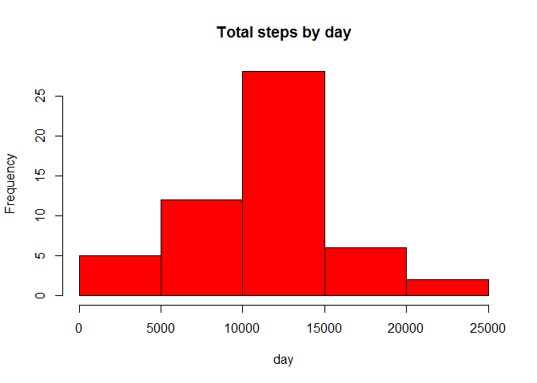
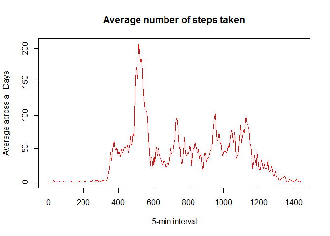
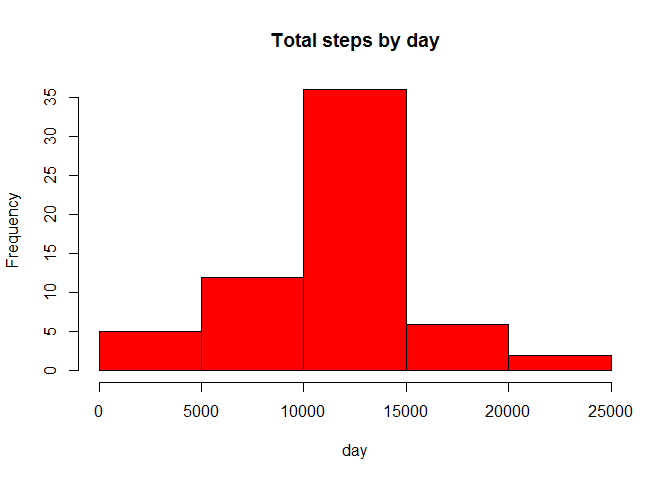
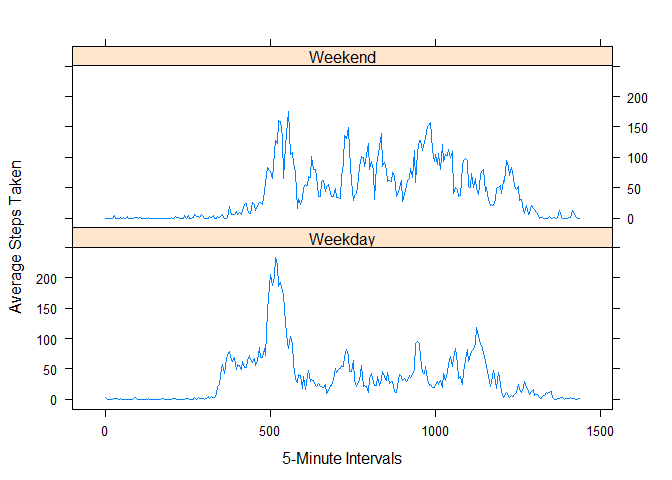

# Reproducible Research: Peer Assessment 1

## Loading Libraries


```r
library(lattice)
```
## Loading and preprocessing the data

### 1. Load the data (i.e read.csv())


```r
activityData <- read.csv("activity.csv")
activity<- read.csv("activity.csv")
head(activityData)
```

```
##   steps       date interval
## 1    NA 2012-10-01        0
## 2    NA 2012-10-01        5
## 3    NA 2012-10-01       10
## 4    NA 2012-10-01       15
## 5    NA 2012-10-01       20
## 6    NA 2012-10-01       25
```
### 2. Process / transform the data into a form that is suitable


```r
names(activityData)
```

```
## [1] "steps"    "date"     "interval"
```

```r
activityData$interval <- 60*floor((activityData$interval+1)/100) + (activityData$interval %% 100)
```
## What is mean total number of steps taken per day?

###1. Calculating the total number of steps taken per day

```r
stepsByDay <- aggregate(steps ~ date, data = activityData, sum, na.rm = TRUE)
```

### 2. Make a histogram of the total number of steps taken each day

```r
hist(stepsByDay$steps, main = "Total steps by day", xlab = "day", col = "red")
```

 

### 3. Calculate and report the mean and median total number of steps taken per day

```r
stepsByDayMean <- mean(stepsByDay$steps)
stepsByDayMean
```

```
## [1] 10766.19
```

```r
stepsByDayMedian <- median(stepsByDay$steps)
stepsByDayMedian
```

```
## [1] 10765
```
* Mean: 10766.19
* Median: 10765

## What is the average daily activity pattern?

###1. Making a time series plot

```r
time_series <- tapply(activityData$steps, activityData$interval, mean, na.rm = TRUE)

plot(row.names(time_series), time_series, type = "l", xlab = "5-min interval", 
    ylab = "Average across all Days", main = "Average number of steps taken", 
    col = "red")
```

 

##2. Which 5-minute interval, on average across all the days in the dataset, contains the maximum number of steps?

```r
max_act_num <- which(time_series==max(time_series))
max_act_int <- activityData$interval[max_act_num]
sprintf("%02d:%02d", floor(max_act_int/60), max_act_int %% 60)
```

```
## [1] "08:35"
```

```r
max_act_int
```

```
## [1] 515
```
* Most Steps at: 08:35
* Maximum number of steps: 515

## Inputing missing values

##1. Calculate and report the total number of missing values in the dataset

```r
numMissingValues<-sum(is.na(activityData))
```
* Number of missing values: 2304

##2. Devise a strategy for filling in all of the missing values in the dataset. The strategy dows not need to be sophisticated. 

###The daily activity pattern is used to input into these missing values. The average number of steps for that 5 minute interva is used as a replacement of the missing value.

```r
StepsAverage <- aggregate(steps ~ interval, data = activityData, FUN = mean)
fillNA <- numeric()

for (i in 1:nrow(activityData)) {
    obs <- activityData[i, ]
    if (is.na(obs$steps)) {
        steps <- subset(StepsAverage, interval == obs$interval)$steps
    } else {
        steps <- obs$steps
    }
    fillNA <- c(fillNA, steps)
}
```

##3. Create a new dataset that is equal to the original dataset but with the missing data filled in.

```r
new_activity <- activityData
new_activity$steps <- fillNA
```

##4. Make a histogram of the total number of steps taken each day

```r
StepsTotal2 <- aggregate(steps ~ date, data = new_activity, sum, na.rm = TRUE)

hist(StepsTotal2$steps, main = "Total steps by day", xlab = "day", col = "red")
```

 

## ... and Calculate and report the mean and median total number of steps taken per day.

```r
mean(StepsTotal2$steps)
```

```
## [1] 10766.19
```

```r
median(StepsTotal2$steps)
```

```
## [1] 10766.19
```
*Mean (Imputed): 10766.19
*Median (Imputed): 10766.19

### After replacing the missing values, the mean is the same but the median is slightly a bit different.

## Are there differences in activity patterns between weekdays and weekends?

## 1. Create a new factor variable in the dataset with two levels - "weekday" and "weekend" indicating whether a given date is a weekday or weekend day.

```r
activityData$day <- weekdays(as.Date(activityData$date))
```


```r
daylevel <- vector()
```


```r
for (i in 1:nrow(activityData)) {
    if (activityData$day[i] == "Saturday") {
        daylevel[i] <- "Weekend"
    } else if (activityData$day[i] == "Sunday") {
        daylevel[i] <- "Weekend"
    } else {
        daylevel[i] <- "Weekday"
    }
}
activity$daylevel <- daylevel
activity$daylevel <- factor(activity$daylevel)

stepsByDay <- aggregate(steps ~ interval + daylevel, data = activityData, mean)
names(stepsByDay) <- c("interval", "daylevel", "steps")
```

##2. Make a panel plot containing a time series plot

```r
xyplot(steps ~ interval | factor(daylevel),
       data=stepsByDay,
       type = 'l',
       layout = c(1, 2),
       xlab="5-Minute Intervals",
       ylab="Average Steps Taken")
```

 
